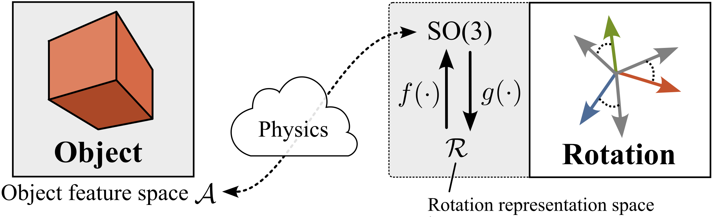
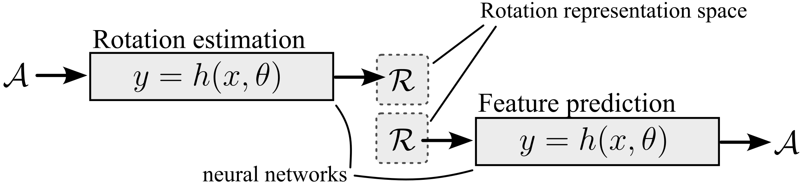

<h1 align="center">
  <br>
  Hitchhiking Rotations
  <br>
</h1>

<h4 align="center">
Code for ICML 2024: <a href="some_ariv_link" target="_blank">"Position Paper: Learning with 3D rotations, a hitchhiker’s guide to SO(3)"</a>.</h4>

<p align="center">
  <a href="#overview">Overview</a> •
  <a href="#installation">Installation</a> •
  <a href="#experiments">Experiments</a> •
  <a href="#development">Development</a> •
  <a href="#credits">Credits</a>
</p>


<p align="center" width="60%">

</p>   

# Overview
Our work discusses recent trends on neural network regression with 3D rotations.

<p align="center" width="60%">

</p>

While the *choice of loss function* is important for learning with rotations, we illustrate that the *choice of rotation representation* (e.g., Euler angles, exponential coordinates, axis-angle, quaternions) is crucial.

**Our recommendations for neural network regression with 3D rotations:**

- **Changing the loss does not fix discontinuities** representations with three or four parameters introduce discontinuities into the target function when rotations are in the output. The subsequent issues arising in learning the target function are not fixed using distance picking or computing distances in $\mathrm{SO}(3)$.

- **For rotation estimation (rotations in model output)** use $\mathbb{R}^9+\mathrm{SVD}$ or $\mathbb{R}^6+\mathrm{GSO}$. If the regression targets are only small rotations, using quaternions with a halfspace-map is a good option.

- **For feature prediction (rotations in model input)** use $\mathbb{R}^9+\mathrm{SVD}$ or $\mathbb{R}^6+\mathrm{GSO}$. If under memory constraints, quaternions with a halfspace-map and data-augmentation are viable.

> [!NOTE]  
> To support these recommendations, we conducted several experiments and reproduced the results of previous works.
> To reproduce the paper's results, setup the environment as detailed in [Installation](#installation) and
> follow the instructions in [Experiments](#experiments).

# Installation
(virtual environment or just list of dependencies) 
(using git lsf to get datasets and our checkpoints/models)

```shell
git clone git@github.com:martius-lab/hitchhiking-rotations.git
pip3 install -e ./
pip3 install torch torchvision torchaudio
```

# Experiments
All experiments are implemented in PyTorch. 
Most experiments simply use [train.py](scripts/train.py).
Depending on which command line arguments are passed (see below), 
[train.py](scripts/train.py) runs different neural network regression tasks via [hydra](https://hydra.cc/).

The repo is organized as follows:

- [./hitchhiking_rotations](hitchhiking_rotations) contains rotation representation helper functions, config files, data generators, loss functions, data loaders, and models.
- [./assets/datasets](assets/datasets) contains the datasets used in the experiments. 
By default, the data inside the folders is used to train models. If you want to generate new data using the scripts in [hitchhiking_rotations/datasets](hitchhiking_rotations/datasets), just delete the files in this folder.
- [./assets/results](assets/results) contains trained models, plots, and
learning results that have been stored using [logger.py](hitchhiking_rotations/utils/logger.py).
- [./visu](hitchhiking_rotations/visu) contains scripts to visualize the results of the experiments and reproduce figures.

### Data

To reproduce the paper's experiments, download the data, and save it in the `assets/datasets` folder.

> [!NOTE]  
> The data is available here: [link](PUT-LINK-HERE)


### Experiment 1, 2.1, and 2.2

| **Experiment**                 | **Type**            | `<EXPERIMENT-NAME>`    |
|--------------------------------|---------------------|------------------------|
| 1: Rotation from point clouds  | Rotation estimation | `"pcd_to_pose"`        |
| 2.1: Cube rotation from images | Rotation estimation | `"cube_image_to_pose"` |
| 2.2: Cube rotation to images   | Feature prediction  | `"pose_to_cube_image"` |

```console
python scripts/train.py --experiment <EXPERIMENT-NAME>
```

### Experiment 3: 6D object pose estimation

Experiment 3 has its own [repository](PUT-LINK-HERE).

### Experiment 4: SO(3) as input to Fourier series
```console
for nb in {1..5}; do for seed in {1..20}; do python scripts/train.py --seed $seed --experiment "pose_to_fourier_$nb"; done; done
```

### Plots

To reproduce the paper's figures, run the following commands:

| **Figures**                        | **Console command**                  |
|------------------------------------|--------------------------------------|
| Experiment 1                       | TBD                                  |
| Experiment 2.1                     | `python visu/figure12a.py`           |
| Experiment 2.2                     | `python visu/figure12b.py`           |
| Experiment 3                       | TBD                                  |
| Experiment 4                       | `python visu/figure14.py`            |
| Figure 6 & 18: Lipschitz constants | `python visu/lipschitz_constants.py` |
| Figure 16: MoCap data analysis     | TBD                                  |
| Figure 17: Loss gradients          | `python visu/loss_gradients.py`      |

# Development
### Code Formatting
```shell
pip3 install black==23.10
cd hitchhiking_rotations && black --line-length 120 ./

# Using precommit
pip3 install pre-commit
cd hitchhiking_rotations && python3 -m pre_commit install
cd hitchhiking_rotations && python3 -m pre_commit run

```
### Add License Headers
```shell
pip3 install addheader
# If your are using zsh otherwise remove \
addheader hitchhiking_rotations -t .header.txt -p \*.py --sep-len 79 --comment='#' --sep=' '
```

# Credits
TBD
